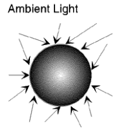
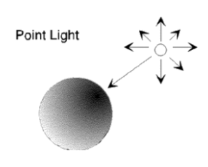
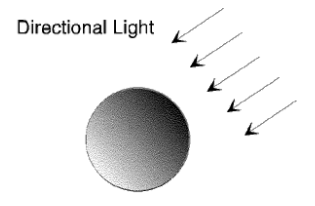
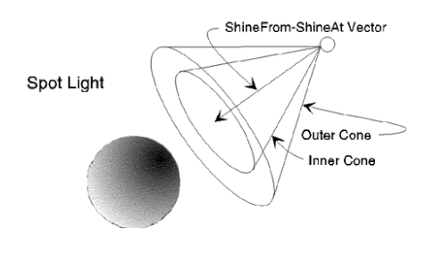
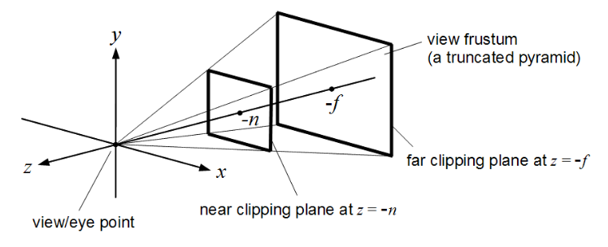
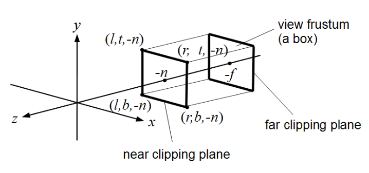

# Three.js — Quick Notes

## Dimensions
- **0D:** a single point  
- **1D:** a line  
- **2D:** a flat shape  
- **3D:** a solid shape (length, width, depth)  
- **4D:** time (used for animation)

## Rendering Stack
- **OpenGL:** a long-used standard for drawing 2D/3D.  
- **WebGL:** brings that power to the browser with JavaScript (strong, but low-level).  
- **Three.js:** a JavaScript library on top of WebGL that makes 3D much easier.

---

## Core Concepts
**Scene** — the main container where everything lives.  
**Environment** — the background/sky around your scene. You can change it (day/night, sunny/rainy).  
**Objects** — things in the scene (cubes, models, etc.).  
**Animation** — makes things move or change (position, rotation, size, material, texture).  
**Lighting** — helps us see shapes and details (can be global or per object).  
**Camera** — decides what part of the scene we see (first-person, third-person, etc.).  
**Renderer** — draws the scene from the camera onto the web page.

---

## Common 3D Object Types
- **Mesh** — most common; a **geometry** (shape) plus a **material** (appearance).  
- **Points** — many small dots (good for stars or particles).  
- **Line** — simple lines (grids, outlines).  
- **Group** — a container to organize multiple objects (like a folder).  
- **Sprite** — a flat object that always faces the camera (good for icons/effects).

_All of these come from **`Object3D`** and support the same transforms:_
- **position** — move on **X** (left/right), **Y** (up/down), **Z** (near/far)  
- **rotation** — rotate around X, Y, or Z  
- **scale** — change size on X, Y, or Z

---

## Mesh Anatomy
### Geometry (the shape)
- **Vertices** — points in 3D space.  
- **Edges** — lines connecting the points.  
- **Faces** — flat surfaces made from the edges and points.

### Material (the look)
- Controls color and how light affects the surface (rough, shiny, transparent, glowing, etc.).  
- You can add a **texture** (an image) to give more detail (like wood, metal, stone).

---

## Lights
- **AmbientLight** — soft light everywhere, no strong shadows.  

- **PointLight** — light from one point in all directions (like a bulb).  

- **DirectionalLight** — light coming from one direction with parallel rays (like the sun).  

- **SpotLight** — a cone of light (like a stage spotlight).  

- **HemisphereLight** — light from above and below (like sky and ground).

---

## Cameras
### Two main camera types
- **PerspectiveCamera**  
  - Like human eyes.  
  - Things **closer look bigger**, things **farther look smaller**.  
  - Good for most 3D scenes, games, and realistic views.  

- **OrthographicCamera**  
  - **No size change with distance**.  
  - Everything keeps the **same size** no matter how far it is.  
  - Good for 2D-style layouts, maps, plans, and UI views.  

**Camera basics**
- **FOV (Field of View)**  
  - How **wide** the camera sees (in degrees).  
  - Smaller number = **zoomed-in** (narrow view, like a zoom lens).  
  - Bigger number = **zoomed-out** (wide view, more of the scene).  
  - Common friendly values: **50–75**.

- **Aspect ratio**  
  - The shape of the view: **width / height**.  
  - Must match your canvas or browser window shape so the image is not stretched.

- **Near / Far (clipping)**  
  - The **minimum** and **maximum** distances the camera will draw.  
  - Objects closer than **Near** or farther than **Far** will **not** be shown.  
  - Pick numbers that cover **only what you need** (too big can cause depth issues).

- **Position**  
  - Where the camera is in the world: X (left/right), Y (up/down), Z (near/far).  

- **Rotation / Target**  
  - Which way the camera is facing.  
  - With orbit-style controls, you usually **point the camera at a target** (for example, the center of your scene).

---

## Camera Controls (popular)
- **OrbitControls** — rotate around a target, zoom, and pan.  
- **FirstPersonControls** — move like in a first-person game.  
- **FlyControls** — move freely in any direction.

---

## TL;DR
- Three.js makes WebGL easy for the web.  
- Start with **Scene + Camera + Renderer**.  
- Then add **Objects + Lights + Controls + Animation**.  
- Geometry = shape, Material/Texture = look, Lights = visibility, Camera = what you see, Renderer = draws it.
